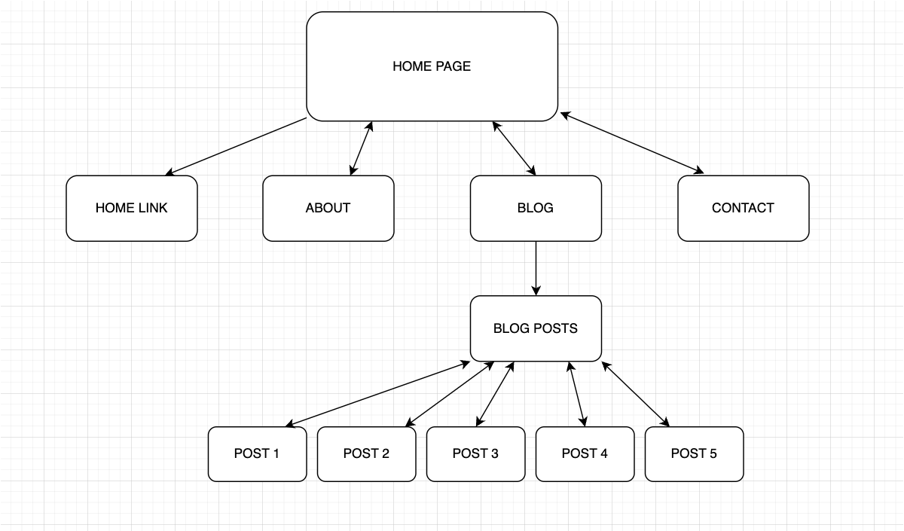
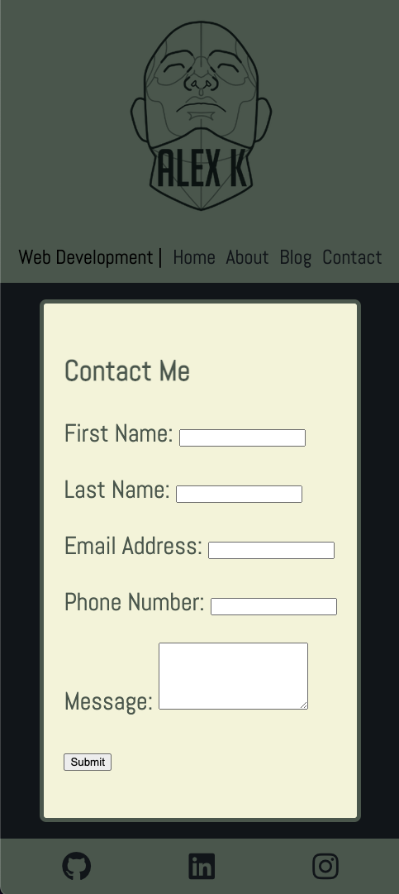
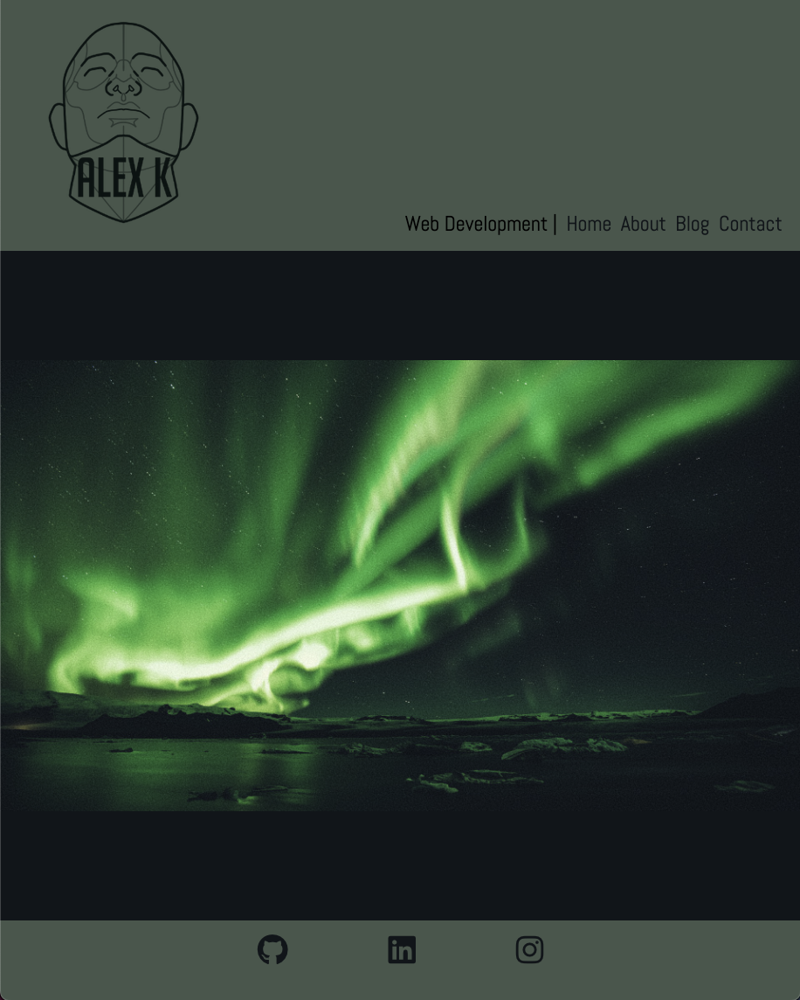
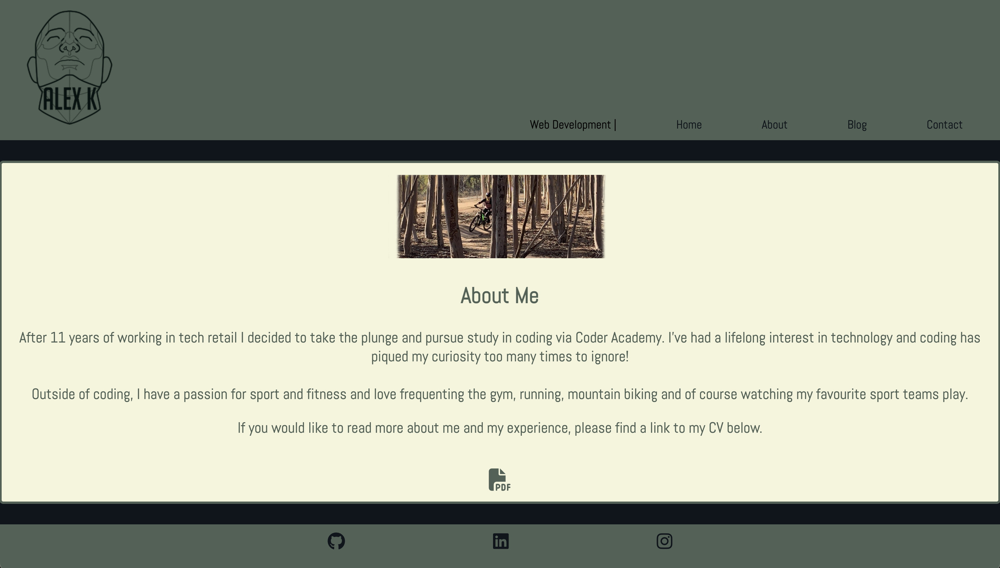

# Alex Karacsay - Portfolio

## Overview 
This is the documentation for my portfolio project. Here you will find the relevant links and information for the site.

## Links
### **Published website**
insert link here
### **Github repo**
[Github repo](https://github.com/alex-the-pigeon/AlexKaracsay_T1A2)
### **Presentation video**
insert link here

## Site description
The site has a very basic and clean design featuring a navigation bar at the top of the page with links to home, about, blog and contact pages. Once I have projects to showcase, a projects page can easily be added. The target audience will be prospective employers.

## Tech stack
HTML, CSS and SCSS were used to write the website as well as Markdown for this README file. The code was written in VSCode, pushed to GitHub and deployed via Netlify. The wireframes were created using Figma and the images used (sourced from Unsplash) were edited using Pixelmator Pro. The website logo was created using Procreate on iPad.

## Components - Design
### Sitemap


### Screenshots
I have included three screenshots of the site each featuring a different page. One is mobile, one tablet and one desktop view.








## Components - Code

### Header
Header has website logo and navigation bar with links to home, about, blog and contact pages. The design of the header is to be responsive to different screen sizes. On mobile and tablet view the logo will appear on top with the links underneath and desktop view will shift logo to the left and links to the right of the page. I have included the HTML and SCSS below.

```
    <header>
        <div class="logo-name">
            <a href="./index.html">
                
            </a>
          
        </div>
        <nav class="nav-items">
           Web Development   |
            <a href="./index.html">Home</a>
            <a href="./about.html">About</a></button>
            <a href="./blog.html">Blog</a>
            <a href="./contact.html">Contact</a>
        </nav>
    </header>
```
```
header {
    @include background-stuff();

     .logo-name {
        @media screen and (max-width: 600px){
            
        }
        margin-bottom: 24px;
    }
    
    .nav-items {
        width: 100%;
        display: flex;
        justify-content: space-around;
        font-size: 24px;
        font-family: 'Abel', sans-serif;
        

        a {
            
            text-decoration: none;
            color: #0E151B;
            
        }

        a:hover {
            color: beige;
          }
    }
}
```

### Body
The body of the home page features a large image. The body of each respective page contains the relevant content ie: information about me, blog posts and contact details.

### Footer
Footer has social media links to Github, LinkedIn and Instagram. These links open in a new window to the home page of each website. Below is the HTML and SCSS for the footer.
```
<footer>
        <div class="social-media">
            <a href="https://www.github.com" target="_blank">
                <i class="fa-brands fa-github"></i>
            </a>
            <a href="https://www.linkedin.com" target="_blank">
                <i class="fa-brands fa-linkedin"></i>
            </a>
            <a href="https://www.instagram.com" target="_blank">
                <i class="fa-brands fa-instagram"></i>
            </a>
        </div>
       
    </footer>
```
```
footer {
    @include background-stuff();

    .social-media {
        display: flex;
        justify-content: space-around;
        margin-bottom: 24px;

        a {
            i {
                color:#0E151B;
                font-size: 36px;

            }
            
        }
    }
    
}

@media screen and (min-width: 600px) {
    footer {
        .social-media {
            width: 50%;
            margin-left: auto;
            margin-right: auto;
            
        }
    }
}
```


